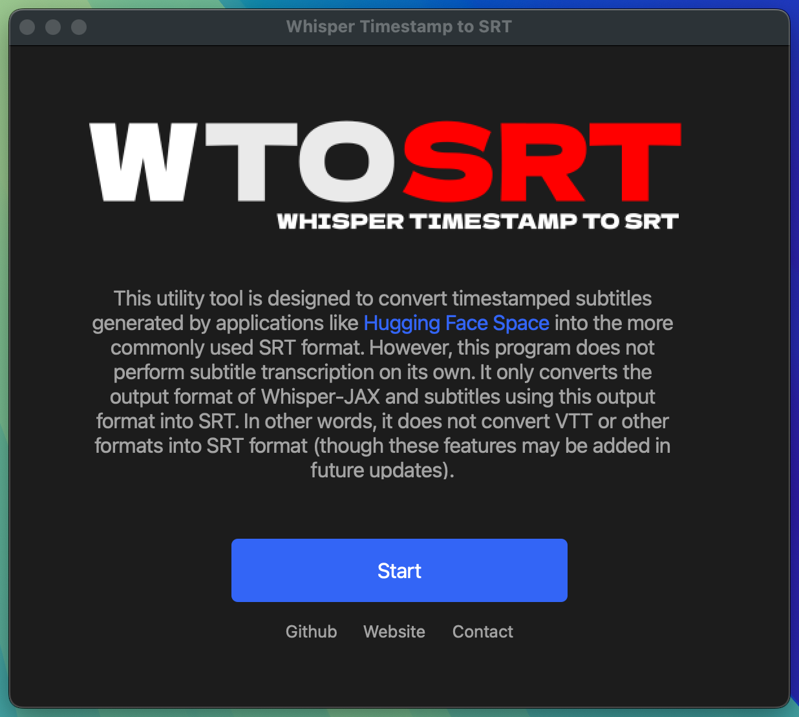
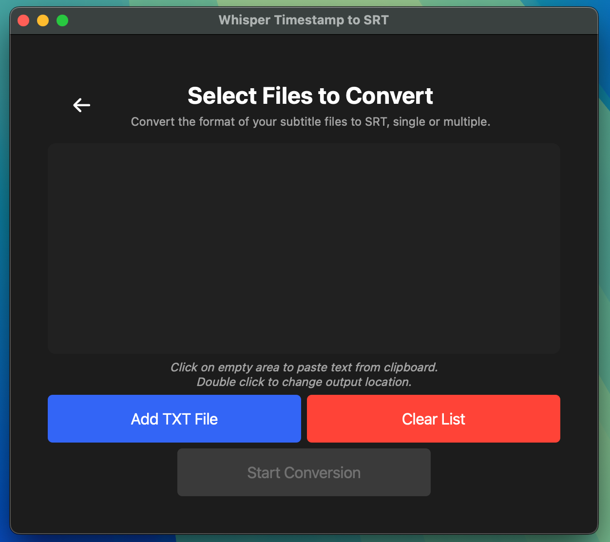
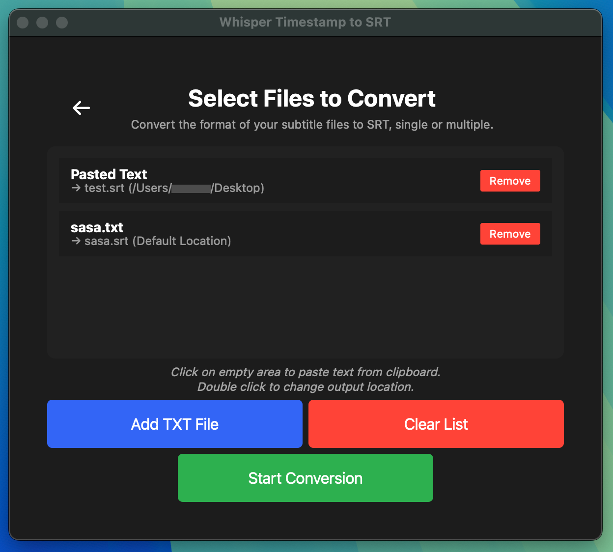

# Whisper-Timestamp-to-SRT

### What is this application and what does it do?
This tool is designed to convert timestamped subtitles generated by applications like [Hugging Face Space](https://huggingface.co/spaces/sanchit-gandhi/whisper-jax) into the widely used SRT format. The program does not create subtitles on its own; it only converts Whisper-JAX and similar format outputs to SRT format. It does not convert VTT or other formats to SRT (these features may be added in future updates).

### Features
- Easy to use interface
- Compatible with all devices
- Multi-operation support
- Error checking mechanism
- Open source

## Interface view:





## Installation and Requirements

**NOTE:** If Python or pip commands don't work, try using python3 or pip3.

### Installation for Windows:
1. **Python 3.x**
   - You can download the latest stable version from [Python's official website](https://www.python.org/downloads/)
   - Don't forget to check "Add Python to PATH" during installation

2. **PyQt5 Installation**
   ```bash
   pip install PyQt5
   ```

3. To run the application, navigate to the directory containing the file via terminal and run the following command:
   ```bash
   python app.py
   ```

### Installation for macOS:
1. **Python 3.x**
   - Installation with Homebrew:
   ```bash
   brew install python3
   ```
   - Or download the macOS installation file from [Python's official website](https://www.python.org/downloads/)

2. **PyQt5 Installation**
   ```bash
   pip3 install PyQt5
   ```

3. To run the application, navigate to the directory containing the file via terminal and run the following command:
   ```bash
   python3 app.py
   ```

### Installation for Linux:
1. **Python 3.x**
   - For Ubuntu/Debian:
   ```bash
   sudo apt-get update
   sudo apt-get install python3
   ```
   - For Fedora:
   ```bash
   sudo dnf install python3
   ```

2. **PyQt5 Installation**
   - For Ubuntu/Debian:
   ```bash
   sudo apt-get install python3-pyqt5
   ```
   - Or installation with pip:
   ```bash
   pip3 install PyQt5
   ```

3. To run the application, navigate to the directory containing the file via terminal and run the following command:
   ```bash
   python3 app.py
   ```